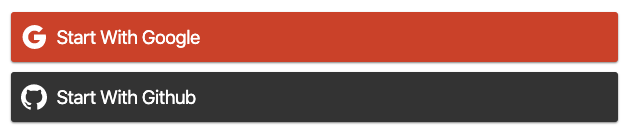

# firebase components



## Usage

```
yarn add firebase-react-components
```

```tsx
import { GoogleButton, GithubButton, useAuthData } from 'firebase-react-components'
import React from 'react'
import { H1, Image, Text, Box, Row } from 'hybrid-components'
import firebase from 'firebase'

const App = () => {
    if (!firebase.apps.length) {
        firebase.initializeApp(firebaseConfig)
    }
    return (
        <Box alignContent='center' alignItems='center'>
            <AuthProvider
                noPersistence
                onLogin={async (user, creds) => {
                    console.log(creds.toJSON())
                }}
                onError={(e) => alert(e.message)}
            >
                <GoogleButton
                    text='Start With Google'
                    // scopes={['https://www.googleapis.com/auth/cloud-platform']}
                />
                <GithubButton text='Start With Github' />
                <DisplayUser />
            </AuthProvider>
        </Box>
    )
}

const DisplayUser = () => {
    const { user={}, loading } = useAuthData()
    if (loading) {
        return <>loading...</>
    }
    return (
        <Box maxWidth='800px' overflowX='scroll'>
            <pre>{JSON.stringify(user, null, 4)}</pre>
        </Box>
    )
}
```

Usage with an external cookie created in admin with `admin.auth().createSessionCookie()`
This way the button keeps track of the signed in status reading the cookie

```tsx
import { default as React } from 'react'
import { GoogleButton } from 'firebase-react-components'
import firebase from 'firebase/app'
import 'firebase/auth'
import { FIREBASE_CONFIG } from '../constants'
import Router from 'next/router'

const FIREBASE_COOKIE_NAME = 'cookiename'

const Page = () => {
    if (!firebase.apps.length) {
        firebase.initializeApp(FIREBASE_CONFIG)
        firebase.auth().setPersistence(firebase.auth.Auth.Persistence.NONE)
    }

    return (
        <GoogleButton
            text='Start With Google'
            useCookie={FIREBASE_COOKIE_NAME} // to get the signed in state
            onLogin={onLogin}
        />
    )
}

async function onLogin(user: firebase.User) {
    const idToken = await user.getIdToken()
    const response = await fetch('/api/login', {
        method: 'POST',
        credentials: 'include',
        body: idToken,
    })
    if (!response.ok) {
        alert(response.statusText)
        return
    }
    console.log(JSON.stringify(user, null, 4))
    await Router.push('/')
}
```
